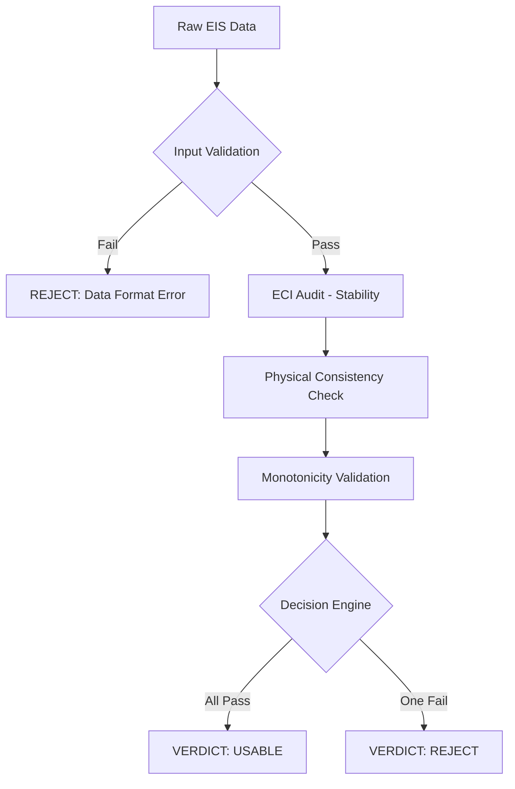

# BATT-SENSE Compliance Audit 🛡️ (v205.5)

[](https://github.com/FATILI80/Batt-sense-compliance-audit/actions)


Dieses Repository bietet ein hochspezialisiertes Framework zur automatisierten Qualitätssicherung von Batterie-Impedanzdaten (EIS). Es fungiert als strenger **"digitaler Türsteher"**, der unphysikalischen Datenmüll filtert, bevor dieser in ML-Pipelines oder Diagnosesysteme fließt.

## 🚀 Key Features (v205.5 Professional)


 * ✅ **ECI-Audit:** Berechnung des Electrical Consistency Index zur Erkennung von Signal-Drift ohne "magische Konstanten".
 * ✅ **Physik-Check 2.0:** Validierung der Gradienten-Kohärenz und zusätzliche **Monotonie-Prüfung** der Impedanz-Magnitude.
 * ✅ **Robustes Engineering:** Integrierter NaN-Schutz und explizites Error-Handling für industrielle Datensätze.
 * ✅ **CI/CD Validierung:** Automatisierte Benchmarks gegen das NASA PCoE Dataset (Zelle ID54) direkt in GitHub Actions.
## 📊 Validierung & Stress-Test
Das System beweist seine Trennschärfe durch automatisierte Tests. Ein Audit gegen das NASA PCoE Dataset liefert klare Entscheidungsgrundlagen:
| Szenario | ECI (Ziel < 0.10) | Physik (Ziel > 0.50) | Monotonie | Urteil |
|---|---|---|---|---|
| **NASA Original** | **0.005** ✅ | **0.55** ✅ | **Pass** ✅ | **USABLE** |
| **Rauschen/Artefakt** | **> 0.15** ❌ | **< 0.20** ❌ | **Fail** ❌ | **REJECT** |
## 🛠️ Schnellstart
### Installation
```bash
pip install numpy pandas scipy

```
### Nutzung im Code
```python
from core.batt_sense_core import BattSenseV205_5

# Auditor initialisieren
auditor = BattSenseV205_5(mu_limit=0.10, phys_limit=0.50)

# Audit ausführen
report = auditor.execute(df, battery_id="NASA_B0005")
print(f"Status: {report['verdict']}")

```
## 📄 Beispiel Output (JSON)
```json
{
  "battery_id": "NASA_B0005",
  "eci": 0.0421,
  "phys_consistency": 0.612,
  "monotonic": true,
  "verdict": "USABLE"
}

```
## ⚠️ Abgrenzung (Out of Scope)
BATT-SENSE ist **keine** Blackbox-KI und ersetzt folgende Systeme nicht:
 * **Kein SoH-Predictor:** Bewertet die Datenqualität, nicht den Gesundheitszustand.
 * **Kein Ersatz für Kramers-Kronig:** Industrieller Audit-Layer, keine wissenschaftliche Kausalitäts-Beweisführung.
## 📖 Dokumentation
Eine detaillierte wissenschaftliche Herleitung der Metriken und Grenzwerte findest du in der SCIENTIFIC_LIMITATIONS.md.
**Status:** Production-Ready Guard Engine. Entwickelt für die industrielle Qualitätssicherung.
```

```
